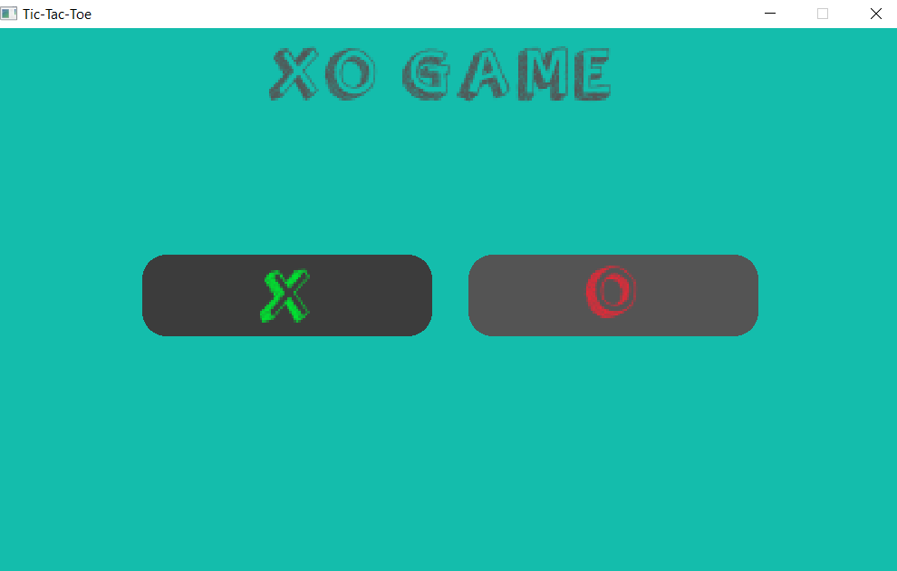

# Tic-Tac-Toe
Tic-Tac-Toe is a classic two-player game. You can enjoy the game in two modes:

* Player vs. Player: Compete against your friend to see who is the ultimate Tic-Tac-Toe master.
* Player vs. AI: Challenge a computer opponent powered by the [Minimax algorithm](https://en.wikipedia.org/wiki/Minimax), which ensures the AI always plays optimally.

This game is built using C++ and [Raylib](https://github.com/raysan5/raylib).

# Build

## Configure 
    $ cmake -S <source_dir> -B <build_dir>

You can use `presets`

    $ cmake -S <source_dir> --preset <preset_name>

To know the existing presets

    $ cmake -S <source_dir> --list-presets

## Build
    $ cmake --build <build_dir>

## Install
    $ cmake --install <build_dir> --prefix <install_dir>

# Requirements
* cmake 
* C++ compiler